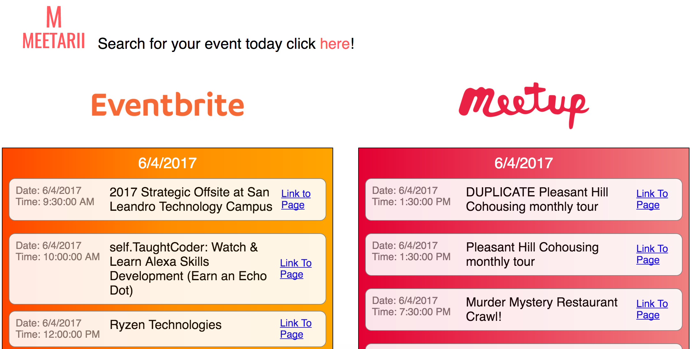

# Meetarii

[Live Link](https://hellojohnito.github.io/Meetarii/#/)

Meetarii is a web application that centralizes networking events from Eventbrite and Meetup to one site. We realized that a lot of coding bootcamp graduates spend a good chunk of their time looking for networking events. We built Meetarii to help graduates spend less time looking and more time attending. With Meetarii, users can now view both events from Eventbrite and Meetup in one location, allowing for a faster lookup and a better time planning.

#### To use this application, please turn on CORS. Meetup's Api has limitations and requires CORS to be enabled.
 - There are many extensions that can help with this!

  https://chrome.google.com/webstore/detail/allow-control-allow-origi/nlfbmbojpeacfghkpbjhddihlkkiljbi?hl=en
